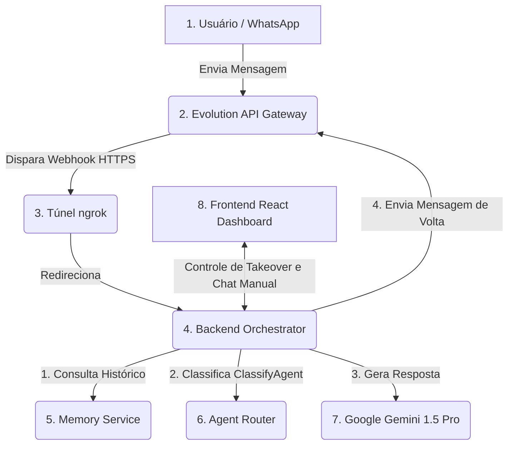
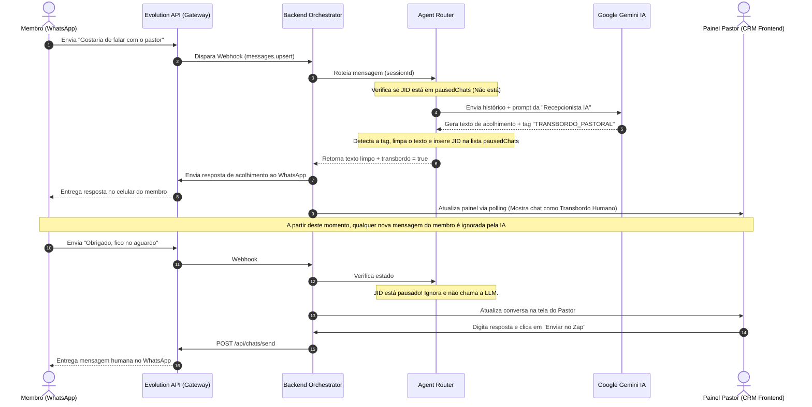

# Arquitetura da Solução de Atendimento Inteligente (WhatsApp IA)

Este documento descreve detalhadamente todos os componentes envolvidos na solução de atendimento inteligente por WhatsApp desenvolvida para a **Igreja Batista Central**. O ecossistema integra Inteligência Artificial Generativa com mensageria instantânea e um painel administrativo para a liderança.

---

## 1. Visão Geral dos Componentes

A solução é composta por 7 componentes principais que se comunicam de forma assíncrona e em tempo real:

---

## 2. Descrição Detalhada dos Componentes

### 1. Usuário (WhatsApp)
* **Papel:** Ponto de partida e chegada da interação. É o celular do membro ou visitante que envia dúvidas, pedidos de oração ou solicitações administrativas.
* **JIDs (WhatsApp IDs):** O sistema lida nativamente com IDs padrão do WhatsApp (`5592xxxxxxxxx@s.whatsapp.net`) e resolve dinamicamente os IDs de privacidade do tipo **LID** (`@lid`) para garantir o envio correto de mensagens individuais.

### 2. Evolution API (Gateway WhatsApp)
* **Papel:** Serve como ponte de comunicação entre o ecossistema e os servidores oficiais do WhatsApp.
* **Tecnologia:** Executado via contêiner Docker (`evoapicloud/evolution-api:latest`) integrado a um banco de dados PostgreSQL.
* **Funcionalidade:**
  * Mantém a conexão ativa (sessão pareada via QR Code).
  * Traduz o protocolo interno do WhatsApp (Baileys) em requisições HTTP amigáveis (Webhooks).
  * Expõe endpoints REST para envio de textos, mídias e controle de conexões.
  * **Cache Local:** Configurado com `CACHE_LOCAL_ENABLED=true` para renderização imediata do QR Code e performance otimizada de sessões na memória.

### 3. Túnel ngrok
* **Papel:** Expõe o servidor local do backend (`http://localhost:5000`) para a internet sob um endereço público seguro e estático (`https://sprig-jigsaw-unwieldy.ngrok-free.dev`).
* **Importância:** Permite que a Evolution API (rodando de forma isolada no Docker ou na nuvem) consiga disparar requisições POST de eventos (Webhooks) diretamente para o backend que roda localmente no computador de desenvolvimento.

### 4. Backend Orchestrator (Node.js / Express)
* **Papel:** Cérebro da aplicação local. Ele gerencia as rotas de webhook, coordena os fluxos de IA, decide se a resposta deve ser enviada e expõe APIs administrativas para o painel web.
* **Principais Arquivos:**
  * `server.js`: Define as rotas express (`/webhooks/whatsapp`, `/api/chats`, `/api/chats/resume`, etc.).
  * `services/messagingService.js`: Responsável por estruturar e disparar as chamadas HTTP de envio da Evolution API v2.
  * `services/memoryService.js`: Gerencia o histórico recente de conversas em memória (evitando estouro de tokens da LLM).

### 5. Agent Router (`agents/agentRouter.js`)
* **Papel:** Filtro inteligente de intenção e controle de estado do bot.
* **Funcionalidades:**
  * **Classificação de Agente:** Lê as palavras-chave da mensagem de entrada e direciona para o agente ideal dentre as 7 personas (Recepcionista, Secretaria, Integração, Oração, Eventos, Mídia).
  * **Filtro Human Takeover:** Se a IA for pausada para um número (devido a atendimento humano), o Router intercepta a mensagem e impede que o assistente responda automaticamente.

### 6. Google Gemini 1.5 Pro (LLM Service)
* **Papel:** Motor de processamento de linguagem natural.
* **Tecnologia:** Consumido via SDK oficial do Google (`@google/generative-ai`) utilizando chaves de API do tipo `AQ.` (suportando a nova arquitetura do Gemini Pro).
* **Personas (System Instructions):** O prompt do sistema é montado de forma dinâmica, instruindo a IA sobre qual persona ela deve adotar, seu tom de voz (Ex: Acolhedor, Empático ou Formal) e como lidar com transbordo pastoral.

### 7. Sistema de Transbordo Humano & CRM Frontend (React)
* **Papel:** Permite que a liderança da igreja assuma o controle do chat a qualquer momento.
* **Fluxo de Pausa (Human Takeover):**
  1. Se a IA gerar a tag técnica `TRANSBORDO_PASTORAL` (ex: em casos de depressão profunda, crises agudas ou pedidos confidenciais), o backend remove a tag da mensagem do usuário e adiciona o JID do contato na lista `pausedChats`.
  2. No painel de controle frontend em React (`PainelAtendimentos.jsx`), o status do chat muda visualmente para "Operador" ou "Transbordo".
  3. O pastor ou líder de atendimento pode clicar em **"Assumir"** para forçar a pausa da IA ou em **"Devolver para IA"** para reativar o bot.
  4. Qualquer mensagem digitada pelo operador e enviada no painel é transmitida diretamente para o celular do membro através da API de envio manual.

---

## 3. Fluxo de Execução da Mensagem (Passo a Passo)

---

## 4. Diagrama Visual da Solução

Abaixo está o diagrama representativo do ecossistema de componentes e do fluxo de ponta a ponta da mensagem:

